Because Tails is supposed to be as "amnesiac" as possible, you want to shield your Tails stick from any extra inputs from, and outputs to, a potentially untrusted network.  This is why **we strongly recommend using a printer that does not have WiFi or Bluetooth**, and hooking up to it using a regular USB cable to print.

Normally, any printer should work with Tails "out of the box."  Most difficulties stem from not selecting the right driver (extra software needed for the printer and computer to communicate).  Luckily, Tails has a large number of drivers for just about any popularly manufactured printer on hand, without even having to download new drivers from the web.

## Setting up a printer with Tails

Boot up Tails with both your persistant volume, and an admin passphrase.

<!--

-->

Make sure your computer is NOT connected to the internet.  This will make sure that your printer set-up is never influenced by a network connection.

Plug in your printer and navigate to Printing.  "Applications -> System Tools -> Administration -> Printing".  You will need to authenticate this action with the admin passphrase you set when booting up Tails.

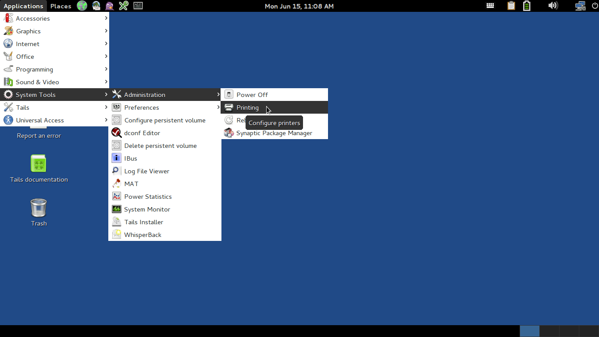
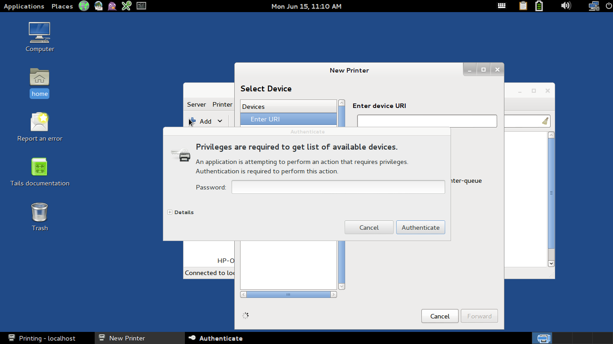

Select "Add".

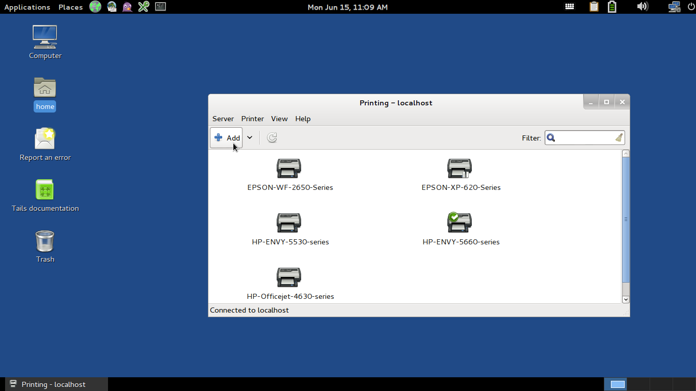

Immediately, Tails will recongize the plugged-in printer, and make the best suggestion from its on-board database of printer drivers.

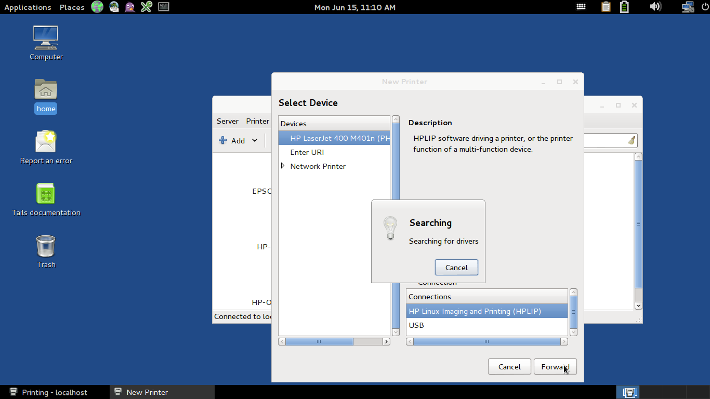

Tails will guide you through a default set-up, suggesting the best match for the printer you have.  These choices come from Tails' pre-installed driver database.

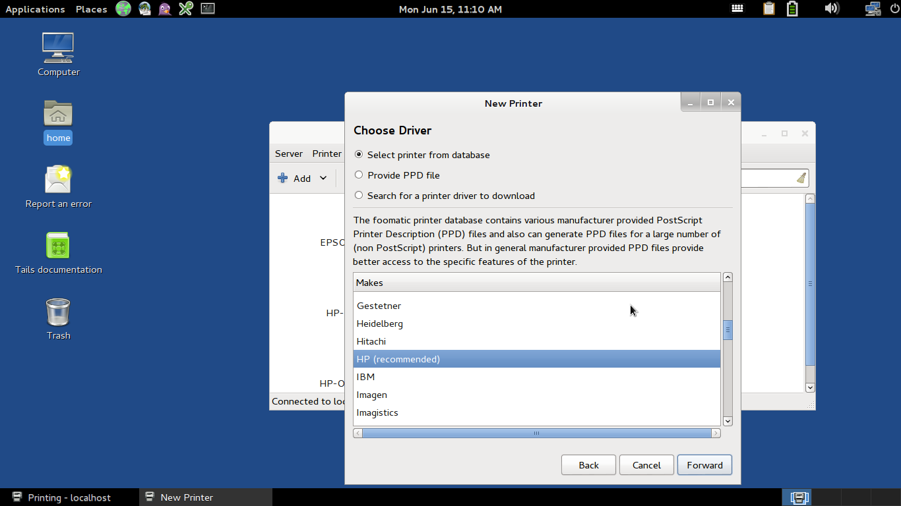
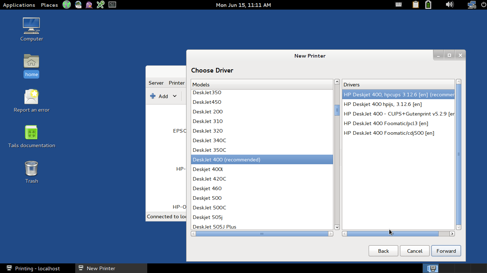

The recommended driver does not always match the actual make and model of your printer, but starting with the recommendations is a good idea.  Sometimes you get lucky, and Tails suggests a perfect match.  Click forward, and apply your settings.

You'll notice that the printer is now listed in your Printing Configurations in your persistent storage.

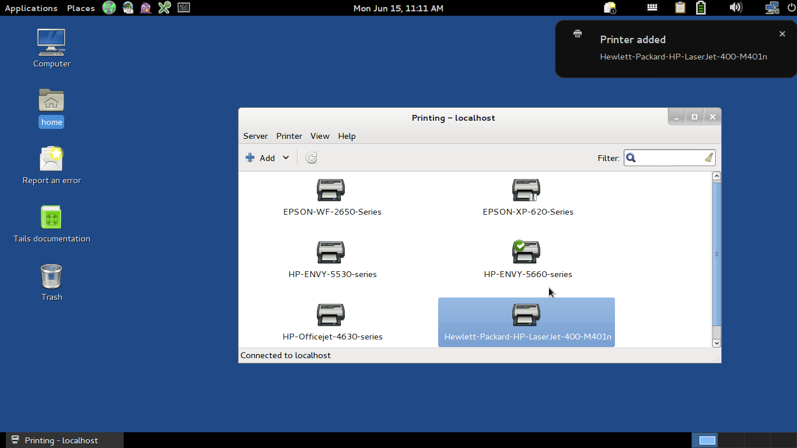

The only way to be sure you have the right driver is by doing a test print.  Right-click on your new printer config and select "Properties" to open its settings, and click "Print Test Page".

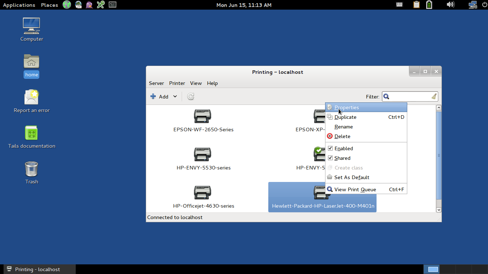

In this initial test, the recommended driver was wrong!  My test page came out garbled, and my printer gave me a warning that I had to manually clear before the page printed.

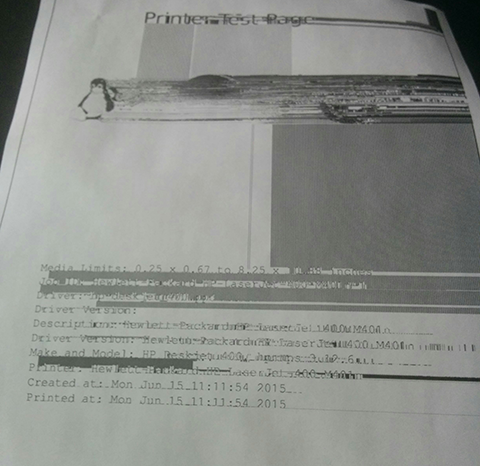
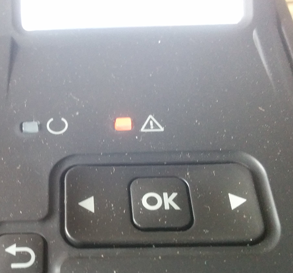

Don't worry if this happens to you; you can edit the printer configuration to point it to the correct driver for your model.  Select "Properties" again and choose "Change..." next to the "Make and Model" directive.

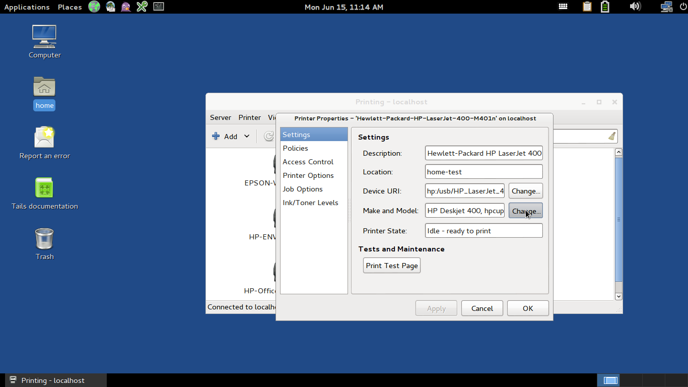

To fix this problem, I selected the CUPS + Gutenprint driver, even though it wasn't recommended.  Click "Forward" to save your changes.

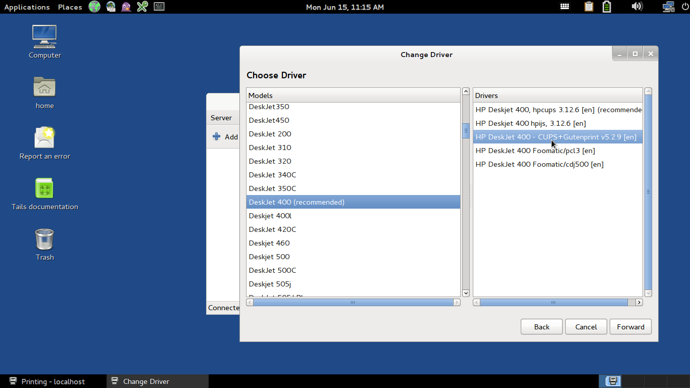

Do another test print, checking your printer for indicators that it's working or not.  This time, printing works perfectly.  If you still experience garbled text, try another driver from your selections.  It is a process of trial-and-error.

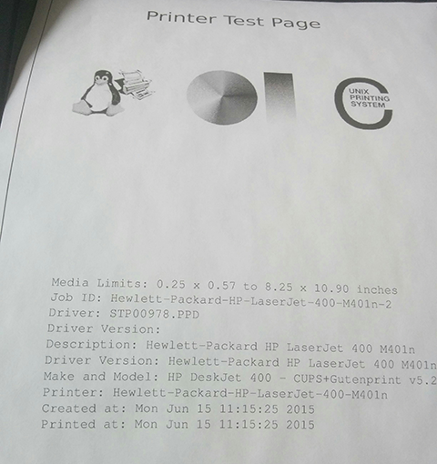
